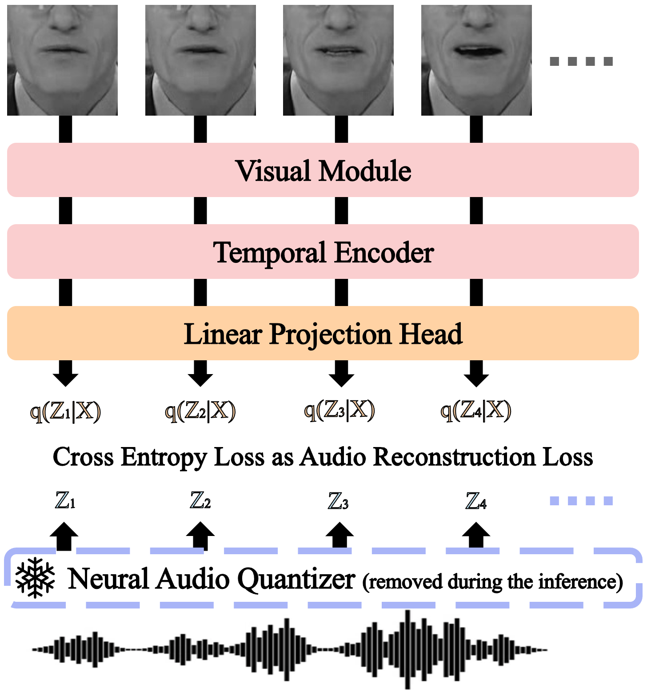

# Cross-Modal Token Synchronization for Visual Speech Recognition

Visual Speech Recognition (VSR) stands at the intersection of computer vision and natural language processing, aiming to decipher spoken content from visual cues. A predominant challenge in VSR is the misalignment of graphemes in ground truth annotations, which often inadequately represent auditory nuances. To address this, we introduce the Cross-Modal Token Synchronization (CMTS) framework. Our method non-autoregressively generates discrete audio tokens from silent video frames, ensuring a synchronized bridge between visual and auditory modalities in one forward pass. Importantly, our framework seamlessly integrates with established temporal architectures, including Transformer, Conformer, and Temporal Convolutional Networks (TCN), without necessitating structural alterations. Evaluations on standard lip reading datasets confirm that our method achieves state-of-the-art results, demonstrating effectiveness of the approach.

### Cross-Modal Token Synchronization (CMTS)

|             Framework Overview              |              Influence of Audio Reconstruction Loss (λ)              |
| :--------------------------------------------: | :----------------------------------------------: |
|  |  |

### Pseudo-Code for the CMTS Framework
```python3
class CrossModalTokenSynchronization(nn.Module):
    """
    - audio_alignment: Ratio of audio tokens per video frame
    - vq_groups: Number of quantized audio groups (i.e. audio channels number in the output of the codec)
    - audio_vocab_size: Vocabulary size of quantized audio tokens of neural audio codec
    - audio_projection: Linear projection layer for audio reconstruction
    """
    def __init__(self, config):
        ...
        self.audio_projection = nn.Linear(config.hidden_size, audio_alignment * vq_groups * audio_vocab_size)
        self.lambda_audio = 10.0 # Larger the better, recommending at least 10 times larger than the loss objective

    def forward(self, videos, audio_tokens, ...):
        # Get traditional VSR objective loss such as Word classification loss, CTC loss, and LM loss
        loss_objective = ...

        # encoding video frames with cls video token
        last_hidden_state = self.encoder(videos) # [B, seq_len+1, hidden_size]

        # Get audio reconstruction loss
        logits_audio = self.audio_projection(last_hidden_state[:, 1:, :]) # [B, seq_len, audio_alignment * vq_groups * audio_vocab_size]
        logits_audio = logits_audio.reshape(B, seq_len, audio_alignment * vq_groups, audio_vocab_size) # [B, seq_len, audio_alignment * vq_groups, audio_vocab_size]
        # For each encoded video frame, it should predict combination of (audio_alignment * vq_groups) audio tokens
        loss_audio = F.cross_entropy(
            logits_audio.reshape(-1, self.audio_vocab_size), # [B * seq_len * (audio_alignment * vq_groups), audio_vocab_size]
            audio_tokens.flatten(), # [B * seq_len * (audio_alignment * vq_groups),]
        )

        # Simply add audio reconstruction loss to the objective loss. That's it!
        loss_total = loss_objective + loss_audio * self.lambda_audio
        ...
```

### Results & Pretrained Models

**Lip Reading in the Wild (LRW) [1] Benchmarks**

|Conference| Method | Spatial | Temporal | Audio Usage | Test Acc1 (%) ↑ |
|:------:| :------: | :-------: | :--------: | :-----: | :-----------: |
|Interspeech '21| [LiRA](https://arxiv.org/abs/2106.09171) [2]| ResNet18 [7] | Conformer [8] | ✔️ | 88.1 |
|AAAI '22| [MVM](https://arxiv.org/pdf/2204.01725v1.pdf) [3] | ResNet18 | MS-TCN [9] | ✔️ | 88.5 |
|ICASSP '22| [Koumparoulis<br />et al](https://ieeexplore.ieee.org/document/9747729) [4] | EfficientNetV2 [10] | Transformer [11] | ❌ | 89.5 |
|ICASSP '22| [Ma et al](https://arxiv.org/pdf/2209.01383.pdf) [5] | ResNet18 | DC-TCN [12] | ❌ | 90.4 |
|ICASSP '23| [MTLAM](https://arxiv.org/pdf/2305.04542.pdf) [6] | ResNet18 | DC-TCN | ✔️ | 91.7 |
|-| Ours | ResNet18 | DC-TCN | ✔️ | **91.8** |
|-| Ours | ResNet18 | Transformer | ✔️ | **92.4** |


Recognizing the challenge of acquiring VSR data [13], our framework advances existing VSR systems in data-limited scenarios by utilizing unsupervisedly trained neural audio codecs such as vq-wav2vec [14] or wav2vec 2.0 [15].

**Without Word Boundary**

| **Temporal Model** | **VSR Data** | **Audio Codec** | **Audio Codec Data** | **Test Acc1 (%) ↑** | URL |
| :-------: | :-------: | :-------: | :-------: | :---------: | :---------: |
| DC-TCN | LRW | - | - | 90.2 | [🔗](https://github.com/KAIST-AILab/CMTS/releases/download/v1/dctcn_lambda0_no_WB_single_9020.ckpt) |
| DC-TCN | LRW | vq-wav2vec | LRW       | 91.8       | [🔗](https://github.com/KAIST-AILab/CMTS/releases/download/v1/dctcn_lambda10_no_WB_dual_9181.ckpt) |
| DC-TCN | LRW | vq-wav2vec | LibriSpeech [16] | 92.3 | [🔗](https://github.com/KAIST-AILab/CMTS/releases/download/v1/dctcn_lambda10_no_WB_Libri.ckpt) |

| **Temporal Model** | **VSR Data** | **Audio Codec** | **Audio Codec Data** | **Test Acc1 (%) ↑** | URL |
| :-------: | :-------: | :-------: | :-------: | :---------: | :---------: |
| Transformer | LRW | - | - | 85.5 | [🔗](https://github.com/KAIST-AILab/CMTS/releases/download/v1/transformer_lambda0_no_WB_single_8551.ckpt) |
| Transformer | LRW | vq-wav2vec | LRW       | 92.4 | [🔗](https://github.com/KAIST-AILab/CMTS/releases/download/v1/transformer_lambda10_no_WB_9240.ckpt) |
| Transformer | LRW | wav2vec 2.0 | LibriSpeech | 92.5 | [🔗](https://github.com/KAIST-AILab/CMTS/releases/download/v1/transformer_lambda10_no_WB_wav2vec2_9254.ckpt) |
| Transformer | LRW | vq-wav2vec | LibriSpeech | 93.1 | [🔗](https://github.com/KAIST-AILab/CMTS/releases/download/v1/transformer_lambda10_no_WB_Libri_fix_9310.ckpt) |

**With Word Boundary**

| **Temporal Model** | **VSR Data** | **Audio Codec** | **Audio Codec Data** | **Test Acc1 (%) ↑** | URL |
| :-------: | :-------: | :-------: | :-------: | :---------: | :---------: |
| DC-TCN | LRW | - | - | 92.7 |  |
| DC-TCN | LRW | vq-wav2vec | LRW       | 93.5 | [🔗](https://github.com/KAIST-AILab/CMTS/releases/download/v1/dctcn_lambda10_WB.ckpt) |
| DC-TCN | LRW | vq-wav2vec | LibriSpeech | 93.9 | [🔗](https://github.com/KAIST-AILab/CMTS/releases/download/v1/dctcn_lambda10_WB_Libri_dual_9390.ckpt) |

| **Temporal Model** | **VSR Data** | **Audio Codec** | **Audio Codec Data** | **Test Acc1 (%) ↑** | URL |
| :-------: | :-------: | :-------: | :-------: | :---------: | :---------: |
| Transformer | LRW | - | - | 89.5 |  |
| Transformer | LRW | vq-wav2vec | LRW       | 94.4 | [🔗](https://github.com/KAIST-AILab/CMTS/releases/download/v1/transformer_lambda10_WB_single_9436.ckpt) |
| Transformer | LRW | wav2vec 2.0 | LibriSpeech | 94.4 | [🔗](https://github.com/KAIST-AILab/CMTS/releases/download/v1/transformer_lambda10_WB_wav2vec2_9441.ckpt) |
| Transformer | LRW | vq-wav2vec | LibriSpeech | 94.8 | [🔗](https://github.com/KAIST-AILab/CMTS/releases/download/v1/transformer_lambda10_WB_Libri_9478.ckpt) |

### Installation
For the replicating state-of-the-art results, please follow the instructions below.
```shell
# install depedency through apt-get
apt-get update 
apt-get -yq install ffmpeg libsm6 libxext6 
apt install libturbojpeg tmux -y

# create conda virtual env
wget https://repo.continuum.io/archive/Anaconda3-2022.10-Linux-x86_64.sh
bash Anaconda3-2022.10-Linux-x86_64.sh -b
source /root/anaconda3/bin/activate base
conda create -n lip python=3.9.13 -y
source /root/anaconda3/bin/activate lip

# install dependencies
git clone https://github.com/KAIST-AILab/CMTS.git
cd CMTS
git clone https://github.com/pytorch/fairseq
cd fairseq
pip install --editable ./
cd ..
pip install -r requirements.txt
wget https://dl.fbaipublicfiles.com/fairseq/wav2vec/vq-wav2vec_kmeans.pt -P ./
```

### Dataset Preparation

1. Get authentification for Lip Reading in the Wild Dataset via https://www.bbc.co.uk/rd/projects/lip-reading-datasets
2. Download dataset using the shell command below

```shell
wget --user <USERNAME> --password <PASSWORD> https://thor.robots.ox.ac.uk/~vgg/data/lip_reading/data1/lrw-v1-partaa
wget --user <USERNAME> --password <PASSWORD> https://thor.robots.ox.ac.uk/~vgg/data/lip_reading/data1/lrw-v1-partab
wget --user <USERNAME> --password <PASSWORD> https://thor.robots.ox.ac.uk/~vgg/data/lip_reading/data1/lrw-v1-partac
wget --user <USERNAME> --password <PASSWORD> https://thor.robots.ox.ac.uk/~vgg/data/lip_reading/data1/lrw-v1-partad
wget --user <USERNAME> --password <PASSWORD> https://thor.robots.ox.ac.uk/~vgg/data/lip_reading/data1/lrw-v1-partae
wget --user <USERNAME> --password <PASSWORD> https://thor.robots.ox.ac.uk/~vgg/data/lip_reading/data1/lrw-v1-partaf
wget --user <USERNAME> --password <PASSWORD> https://thor.robots.ox.ac.uk/~vgg/data/lip_reading/data1/lrw-v1-partag
```
3. Extract region of interest and convert mp4 file into pkl file with the commands below.
```shell
python ./src/preprocess_roi.py
python ./src/preprocess_pkl.py
```

### Train
For training with our methodology, please run the command below after preprocessing the dataset. You may change configurations in yaml files.
```shell
python ./src/train.py ./config/bert-12l-512d.yaml devices=[0] # Transformer backbone
python ./src/train.py ./config/dc-tcn-base.yaml devices=[0] # DC-TCN backbone
```

### Inference

For inference, please download the pretrained checkpoint from the repository's [release section](https://github.com/KAIST-AILab/CMTS/releases/)(or from url attached on the table above) and run the code with the following command.
```shell
python ./src/inference.py ./config/bert-12l-512d.yaml devices=[0] # Transformer backbone
python ./src/inference.py ./config/dc-tcn-base.yaml devices=[0] # DC-TCN backbone
```

### References
<details>
<summary>References</summary>
    <ul>
        <li> [1] Chung, Joon Son and Andrew Zisserman. “Lip Reading in the Wild.” Asian Conference on Computer Vision (2016): 87–103.</li>
        <li> [2] Ma, Pingchuan et al. “LiRA: Learning Visual Speech Representations from Audio through Self-supervision.” Interspeech (2021). </li>
        <li> [3] Kim, Minsu et al. “Distinguishing Homophenes Using Multi-Head Visual-Audio Memory for Lip Reading.” AAAI Conference on Artificial Intelligence (2022). </li>
        <li> [4] Koumparoulis, Alexandros and Gerasimos Potamianos. “Accurate and Resource-Efficient Lipreading with Efficientnetv2 and Transformers.” ICASSP 2022 - 2022 IEEE International Conference on Acoustics, Speech and Signal Processing (ICASSP) (2022): 8467-8471.</li>
        <li> [5] Ma, Pingchuan et al. “Training Strategies for Improved Lip-Reading.” ICASSP 2022 - 2022 IEEE International Conference on Acoustics, Speech and Signal Processing (ICASSP) (2022): 8472-8476.</li>
        <li> [6] Yeo, Jeong Hun et al. “Multi-Temporal Lip-Audio Memory for Visual Speech Recognition.” ICASSP 2023 - 2023 IEEE International Conference on Acoustics, Speech and Signal Processing (ICASSP) (2023): 1-5.</li>
        <li> [7] He, K., Zhang, X., Ren, S., & Sun, J. (2015). Deep Residual Learning for Image Recognition. 2016 IEEE Conference on Computer Vision and Pattern Recognition (CVPR), 770-778. </li>
        <li> [8] A. Gulati et al., “Conformer: Convolution-augmented Transformer for Speech Recognition,” in Interspeech, 2020, pp. 5036–5040. </li>
        <li> [9] Abu Farha, Y., & Gall, J. (2019). MS-TCN: Multi-Stage Temporal Convolutional Network for Action Segmentation. 2019 IEEE/CVF Conference on Computer Vision and Pattern Recognition (CVPR), 3570-3579. </li>
        <li> [10] Tan, Mingxing and Quoc V. Le. “EfficientNetV2: Smaller Models and Faster Training.” International Conference on Machine Learning (2021).</li>
        <li> [11] Vaswani, Ashish et al. “Attention is All you Need.” Neural Information Processing Systems (2017).</li>
        <li> [12] Ma, Pingchuan et al. “Lip-reading with Densely Connected Temporal Convolutional Networks.” 2021 IEEE Winter Conference on Applications of Computer Vision (WACV) (2020): 2856-2865. </li>
        <li> [13] Ma, Pingchuan et al. “Auto-AVSR: Audio-Visual Speech Recognition with Automatic Labels.” ICASSP 2023 - 2023 IEEE International Conference on Acoustics, Speech and Signal Processing (ICASSP) (2023): 1-5.</li>
        <li> [14] Baevski et al., “vq-wav2vec: Self-supervised learning of discrete speech representations,” in ICLR, 2020</li>
        <li> [15] A. Baevski et al., “wav2vec 2.0: A framework for self-supervised learning of speech representations,” NeurIPS, vol. 33, pp. 12449–12460, 2020</li>
        <li> [16] Panayotov, Vassil et al. “Librispeech: An ASR corpus based on public domain audio books.” 2015 IEEE International Conference on Acoustics, Speech and Signal Processing (ICASSP) (2015): 5206-5210. </li>
    </ul>
</details>

